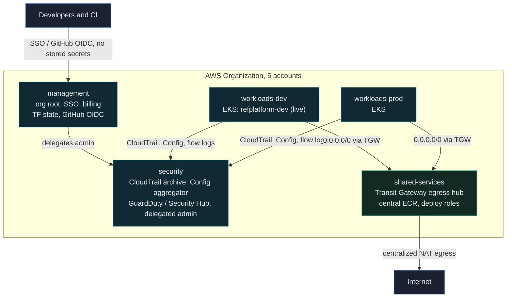
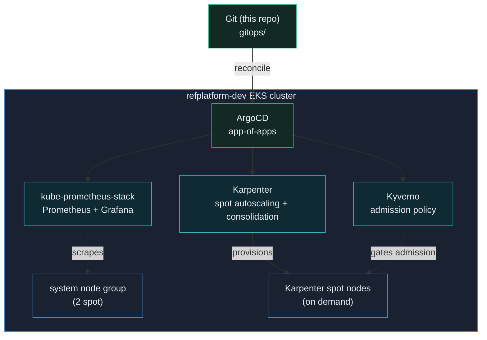

# AWS EKS Reference Platform

A public AWS platform spanning multiple accounts, built entirely in the open. Every architectural decision is documented, every resource is Terraform, and no secret is ever stored in this repository.

## What this is

A forkable reference implementation of an AWS organization hosting a Kubernetes based internal developer platform, demonstrated with a realistic sample workload (a fictional fishing charter booking SaaS). It grows in layers:

| Layer | Scope | Status |
|-------|-------|--------|
| 0 | Org bootstrap: accounts, OUs, SCPs, state backend, GitHub OIDC | ✅ Complete |
| 1 | Landing zone: identity, logging, security tooling, networking, CI/CD | ✅ Complete |
| 2 | EKS platform. **Shipped:** cluster ([ADR-0007](docs/adr/0007-eks-cluster-foundation.md)), GitOps/ArgoCD ([0010](docs/adr/0010-gitops-argocd.md)), Karpenter autoscaling ([0011](docs/adr/0011-karpenter-autoscaling.md)), observability ([0013](docs/adr/0013-observability.md)), Kyverno policy ([0014](docs/adr/0014-policy-kyverno.md)), passwordless dashboards ([0015](docs/adr/0015-dashboard-access-no-second-credential.md)), External Secrets ([0016](docs/adr/0016-platform-secrets-external-secrets.md)). **Not built:** Cilium, service mesh, Backstage | ✅ Core complete |
| 3 | GPU/AI serving: GPU Operator, MIG, vLLM | Planned |
| 4 | Sample workload: fishing-charter SaaS + data pipeline + Bedrock RAG service | Planned |
| 5 | Architecture docs: full ADR log, threat model, FinOps dashboard | Planned |

### Architecture at a glance



### Cluster platform (Layer 2), GitOps-delivered

Terraform bootstraps the cluster and ArgoCD; every platform component after that
lands as a Git-managed ArgoCD `Application` (ADR-0010).



**Defense in depth** wraps all of it: org **SCPs** (region allowlist, deny-root,
deny-disable-audit), **permission boundaries** on every privileged principal
(CI OIDC roles, human SSO sets, service roles, ADR-0012), a **Config conformance
pack** continuously attesting the controls (ADR-0009), and **Kyverno** at the
Kubernetes admission gate (ADR-0014). Nothing stores a long-lived credential.

For the full visual reference (a layered map plus deep-dive flows: the zero-secret
credential path, the write-isolated audit trail, centralized-egress networking, and
the EKS cluster internals), see the **[architecture page](https://samueltillman.github.io/aws-eks-reference-platform/)**
(rendered via GitHub Pages).

## Design principles

1. **Zero stored credentials.** GitHub Actions authenticates to AWS via OIDC. Workloads use IAM roles. Humans use IAM Identity Center SSO. There aren't any IAM users or access keys anywhere in this organization.
2. **Everything is code.** The only manual steps are the unavoidable bootstrap that creates the organization, documented honestly in [docs/bootstrap.md](docs/bootstrap.md).
3. **Forkable by design.** Account IDs, domains, and values specific to your org are variables. Fork it, set your values, deploy your own.
4. **Costs stay capped.** Spot capacity, scale to zero, and a documented destroy and rebuild flow. If it can't be rebuilt from this repo, it doesn't belong in this repo.
5. **Decisions are documented.** Every significant choice gets an Architecture Decision Record (ADR), a short note explaining what we decided and why. New to the concept? Start with [docs/adr/](docs/adr/), which explains the format and indexes every decision.

## Account architecture

```
Management (org root: Organizations, Identity Center, billing only)
├── Security OU
│   └── security        (GuardDuty/Security Hub delegated admin, log archive)
├── Infrastructure OU
│   └── shared-services (CI/CD roles, ECR, networking hub)
└── Workloads OU
    ├── workloads-dev
    └── workloads-prod
```

## Getting started

1. Complete the manual bootstrap: [docs/bootstrap.md](docs/bootstrap.md)
2. Deploy the state backend and GitHub OIDC: `terraform/bootstrap/`
3. Deploy the organization: `terraform/org/`

## License

MIT. See [LICENSE](LICENSE).
